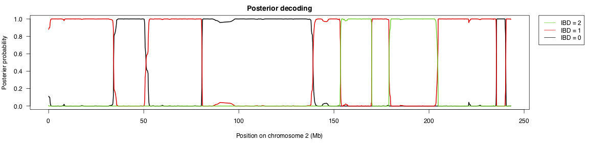

# LocalNgsRelate


## Brief description


This page contains information about the program called LocalNgsRelate, which can be used to infer IBD sharing along the genomes of two individuals from low-depth Next Generation Sequencing (NGS) data by using genotype likelihoods (instead of called genotypes). For an example that illustrates the output see the plot above. To be able to infer the IBD sharing you will need to know the population allele frequencies and have genotype likelihoods. This can be obtained e.g. using the program ANGSD as shown in example 1 below. For more information about ANGSD see here: http://popgen.dk/angsd/index.php/Quick_Start. 

## How to download and install
On a linux or mac system with git and g++ installed LocalNgsRelate can be downloaded and installed as follows:

```
git clone https://github.com/idamoltke/LocalNgsRelate
cd LocalNgsRelate/src/cpp/;make
```

## Help and run options
To see how the program can be run and to see all options, you can type the following command in the folder where the src code is:

```
./localngsrelate 
```
Or from a different folder with full path, e.g.: 

```
/home/ida/Programs/LocalNgsRelate/src/cpp/localngsrelate ## NB. Replace with the path to the program on your computer!
```

## Input file format
### Formal description
LocalNgsRelate takes two files as input: a file with genotype likelihoods (-gbeagle) and a file with population allele frequencies (-f) for the sites there are genotype likelihoods for. 

The genotype likelihood file needs to contain a line for each site with 3 values for each individual (one log transformed genotype likelihood for each of the 3 possible genotypes encoded as 'double's) and it needs to be in beagle format and gz compressed (see e.g. http://www.popgen.dk/angsd/index.php/Beagle_input). Note that the marker name needs to be of the form chromosome name underscore position, so e.g. 1_723918. The reason for this is that the programs needs to know which markes are on the same chromosome and the position of each marker.

The frequency file needs to contain a line per site with the allele frequency of the site in it. 
For examples of the two types of input files see the files in the folder exampledata which are described below.


### Example input files
The example files included here (in the folder exampledata) are made based on LWK 1000G low-depth samples. There are two files:

1) LWK.beagle.gz  a file with genotype likelihoods for 7 individuals at 125034 sites
2) LWK.freq       a file with allele frequency estimates for these sites (based on data from 101 individuals)

Among the 7 LWK individuals there at least 4 pairs of relatives:


| Index ind1 | Index ind2   | 1000G IDs ind1 | 1000G IDs ind2   |Relationships |
| ------------ | ------------ | ------------ | ------------------------ | :------------- | 
|   0   |       1    | "NA19027" | "NA19042"       | Half-sibs |
|   2   |  3    | "NA19313" | "NA19331"       | Parent-offspring |
|   5   |  6    | "NA19451" | "NA19452"       | First cousins |
|   3   |  4    | "NA19331" | "NA19334"       | Full siblings |

As an example of a pair of unrelated individuals you can e.g. use NA19027 and NA19313, so the samples with index 0 and 2. For a description of how this dataset was made see "Making input data" below.

## Output format
Successfully running the program should lead to 3 output files and if run the program with "–o exampleoutput" these will be called

1) exampleoutput.log
2) exampleoutput.parameters
3) exampleoutput.IBDtractinference.gz

The .log file just logs the command called.
The .parameter file contains the obtained ML extimates of a, k0, k1 and k2 followed by the log likelihood for those parameter values.
The IBDtractinference.gz file contains the IBD tract inference results in the following format

```
Chr     Pos     Freq            Viterbi Post0                   Post1                   Post2
1       723918  0.151610        1       3.0884985926685819e-02  9.6911501407414691e-01  0.0000000000000000e+00
1       757691  0.122070        1       2.9787120630633119e-02  9.7021287937161715e-01  0.0000000000000000e+00
1       779322  0.474770        1       2.9543971384025283e-02  9.7045602861803226e-01  0.0000000000000000e+00
1       798959  0.259580        1       2.9304343678521146e-02  9.7069565632360233e-01  0.0000000000000000e+00
1       800007  0.089113        1       2.9302268977282993e-02  9.7069773102524970e-01  0.0000000000000000e+00
```

If you - as shown in the run examples below - run the program with “2>&1 | tee exampleoutput.fulllog” added to the end of your command your will get an additional output file (exampleoutput.fulllog), which contains everything that would otherwise be written to the screen. This can be helpful if you want to assess convergence (for details about this see “Run examples” below). To get this to work you need the program tee installed.


## Run examples

### Making input data
Below we describe how the data in the folder exampledata was made as an example of how input data to LocalNgsRelate can be made. Running the commands yourself will take some time, so feel free to skip that and simply jump to the description of how to run LocalNgsRelate below.

To make the example input files in exampledata we first downloaded bamfiles for 101 LWK samples sequenced to about 6x from here:

```
ftp://ftp.1000genomes.ebi.ac.uk/vol1/ftp/phase3/data/
```

Then we ran the program ANGSD to get a genotype likelihood files as well as frequency estimates:

```
./ANGSD -b LWK.bamlist -GL 1 -doGlf 2 -doMajorMinor 3 -doMaf 1 -sites LWK.sites -rf LWK.chrs -out LWK -minMapQ 30 -minQ 20 -P 4
```

In that command: 

1) LWK.bamlist is a file that contains a line for each bamfile and this line contains the full path of the given bamfile on your system. In our case it consisted of a files with 101 lines.

2) LWK.sites contains a line for each site to include in the dataset and this line contains 4 pieces of information tab separated, namely chromosome number, position, major allele and minor allele. Note that this needs to be indexed by ANGSD for details see http://www.popgen.dk/angsd/index.php/Sites     

3) LWK.chr contains a line for each chromosome the sites file have sites on. So if the sites file contains sites on all 22 autosomes it will contain 22 lines, one for each chromosome. 

For details on what the different options in ANGSD mean see http://www.popgen.dk/angsd/index.php/Genotype_Likelihoods and http://www.popgen.dk/angsd/index.php/Allele_Frequencies. 

The above command will create a file LWK.beagle.gz and a file LWK.mafs.gz. The first one contains genotype likelihoods and is in exactly the format that is needed for LocalNgsRelate. However, note that to make the run examples below faster to run, we subseextracted the GLs only for the first 7 (and only relevant) individuals instead of all 101). The other file, which contains allele frequencies, needs to be altered a bit to work as an input file for LocalNgsRelate. But all we did to make the final input file from it was to run the following command:

```
zcat LWK.mafs.gz | cut -f5 |sed 1d > LWK.freq
```

NB. To make things as simple and easy to follow as possible we here simply assumed that the set of SNP sites to include in the analysis was already available (in the files LWK.sites and LWK.chr). However note that LocalNgsRelate is built on an assumption that there is no linkage disequilibrium (LD) in the data. In practice this means the sites have to be pruned for LD. The this can be tricky to do as LD estimation from low-depth NGS data is not trivial to do. In the paper describing LocalNgsRelate we therefore explored a simple scheme for pruning simply based on SNP distance which worked fairly well and seemed fairly robust to the choice of distance. Specifically, we used the following PLINK command to thin down to 1 SNP every 20kb :

plink -tfile LWK --geno 0.3 --bp-space 20000 --make-just-bim --out LWK.thin

Note that the optimal distance may differ between population since LD patterns do. As a rule of thumb one needs to prune more on populations with more LD (so e.g. in humans one needs to prune less in African populations than in other populations).

###	Analysing selected pairs
Let’s now try to infer IBD tracks for the 5 pairs of individuals in the example dataset mentioned above (in . We can do this from the command line by first creating a folder for the results where you want it on you compute and moving into this folder:

```
mkdir exampleruns
cd exampleruns
```

And then we can run the following commands to analyse the 5 pairs pairs listed above (see “Example input files”):

```
## Set path to the program folder. NB. replace with the path on your own computer! 
localngsrelatefolder="/home/ida/Programs/LocalNgsRelate/"

## Analyse the half sib pair 
$localngsrelatefolder/src/cpp/localngsrelate -a 0 -b 1 -gbeagle $localngsrelatefolder/exampledata/LWK -f $localngsrelatefolder/exampledata/LWK.freq -n 7 -fixk2to0 1 -O exampleoutput_ind0_ind1 2>&1 | tee exampleoutput_ind0_ind1.fulllog

## Analyse the parent offspring pair
$localngsrelatefolder/src/cpp/localngsrelate -a 2 -b 3 -gbeagle $localngsrelatefolder/exampledata/LWK -f $localngsrelatefolder/exampledata/LWK.freq -n 7 -fixk2to0 1 -O exampleoutput_ind2_ind3 2>&1 | tee exampleoutput_ind2_ind3.fulllog

## Analyse the first cousin pair 
$localngsrelatefolder/src/cpp/localngsrelate -a 5 -b 6 -gbeagle $localngsrelatefolder/exampledata/LWK -f $localngsrelatefolder/exampledata/LWK.freq -n 7 -fixk2to0 1 -O exampleoutput_ind5_ind6 2>&1 | tee exampleoutput_ind5_ind6.fulllog

## Analyse the unrelated pair 
$localngsrelatefolder/src/cpp/localngsrelate -a 0 -b 2 -gbeagle $localngsrelatefolder/exampledata/LWK -f $localngsrelatefolder/exampledata/LWK.freq -n 7 -fixk2to0 1 -O exampleoutput_ind0_ind2 2>&1 | tee exampleoutput_ind0_ind2.fulllog

## Analyse the full sib pair  
$localngsrelatefolder/src/cpp/localngsrelate -a 3 -b 4 -gbeagle $localngsrelatefolder/exampledata/LWK -f $localngsrelatefolder/exampledata/LWK.freq -n 7 -O exampleoutput_ind3_ind4 2>&1 | tee exampleoutput_ind3_ind4.fulllog
```

Note that we here specify the prefix of the input genotype likelihood file with the option –gbeagle, the full name of the frequency file with the option –f, the number of individuals in the genotype likelihood file with the option –n and the output name prefix with the option –O. Also, note that we are here running the program with default values except for in the first 4 runs, where we set the option -fixk2to0 1 since we only expect k2 to be above 0 for full siblings or twins. If you are in doubt about whether to fox k2 to 0 you can always run NgsRelate to check first (http://www.popgen.dk/software/index.php/NgsRelate). Finally, note that we have ended each command line with “2>&1 | tee exampleoutput_indx_indy.fulllog” where x and y are the indices of the analysed individuals. This produces a long log file which can be used to assess convergence (for details on how, see below).


### Assessing convergence
If you ran the program as above with “2>&1 | tee exampleoutput_indx_indy.fulllog” you can use the script getlikes.sh in the folder src/scripts like this. E.g. for for individuals 0 and 1 we can run the command:
 
```
$localngsrelatefolder/src/scripts/getlikes.sh exampleoutput_ind0_ind1.fulllog 
```

This should produce a sorted list of log likelihoods for the 20 rounds of optimization that was run (20 is the default number) like this:

```
6	-201338.8335366386163514
13	-201338.8335366389364935
11	-201338.8335366390238050
14	-201338.8335366393439472
7	-201338.8335366394894663
8	-201338.8335366395476740
18	-201338.8335366434475873
17	-201338.8335366445244290
15	-201338.8335366518585943
2	-201338.8335366620740388
3	-201338.8335366707469802
12	-201338.8335366802930366
16	-201338.8335366958635859
5	-201338.8335367221443448
9	-201338.8335368037223816
1	-201338.8335368797124829
0	-201338.8335368825064506
19	-201338.8335369107953738
4	-201338.8335372715082485
10	-201338.8335522015695460
```

As can be seen the top 5 log likelihoods differ very little suggesting that convergence was likely reached (and thus the maximum likelihood solution was found by the program). If this had not been the case, you should consider rerunning the program with a higher number of optimization rounds, say 100 (by rerunning the same command as above but with “–N 100” added).

### Plotting the results
We can plot the final results by opening R and using the script in the folder src/scripts called plotLocalNgsRelateOutput.R. E.g. we can plot the results for the full sibling pair on chromosome 2 as follows:

```
## Read in plotting script. NB. replace with the path to the folder with localngsrelate  
localngsrelatefolder="/home/ida/Programs/LocalNgsRelate/"
source(paste(localngsrelatefolder,"/src/scripts/plotLocalNgsRelateOutput.R",sep=""))

## Read in results        
nam = "exampleoutput_ind3_ind4"                                                 
res = read.table(paste(nam,".IBDtractinference.gz",sep=""),header=T)
      
## Plot results for posterior decoding and viterbi
pdf(paste(nam,"_posteriorandviterbi_chr2.pdf",sep=""),h=4,w=16)                                               
plot.localngsrelate.posterior(res,chr=2,xlab="Position on chromosome 2 (Mb)")
plot.localngsrelate.viterbi(res,chr=2,xlab="Position on chromosome 2 (Mb)")
graphics.off()               
```

Or the results for the parent offspring pair on all chromosomes 

```
## Read in plotting script. NB. replace with the path to the folder with localngsrelate  
localngsrelatefolder="/home/ida/Programs/LocalNgsRelate/"
source(paste(localngsrelatefolder,"/src/scripts/plotLocalNgsRelateOutput.R",sep=""))

## Read in results        
nam = "exampleoutput_ind2_ind3"                                                 
res = read.table(paste(nam,".IBDtractinference.gz",sep=""),header=T)
      
## Plot results for posterior decoding and viterbi 
pdf(paste(nam,"_posteriorandviterbi_allchrs.pdf",sep=""),h=4,w=16)                                               
plot.localngsrelate.posterior(res)
plot.localngsrelate.viterbi(res)
graphics.off()               

```
The results can be seen in here:

Plots for chromosome 2 (ind 3 and 4):  
http://popgen.dk/ida/LocalNgsRelate/exampleoutput_ind3_ind4_posteriorandviterbi_chr2.pdf

Plots for all chromosomes (ind 2 and 3):  
http://popgen.dk/ida/LocalNgsRelate/exampleoutput_ind2_ind3_posteriorandviterbi_allchrs.pdf


## Citing and references
For questions contact: ida@binf.ku.dk

If you use the program in a publication please cite: Severson et al. 2022 (https://doi.org/10.1093/bioinformatics/btab732)

